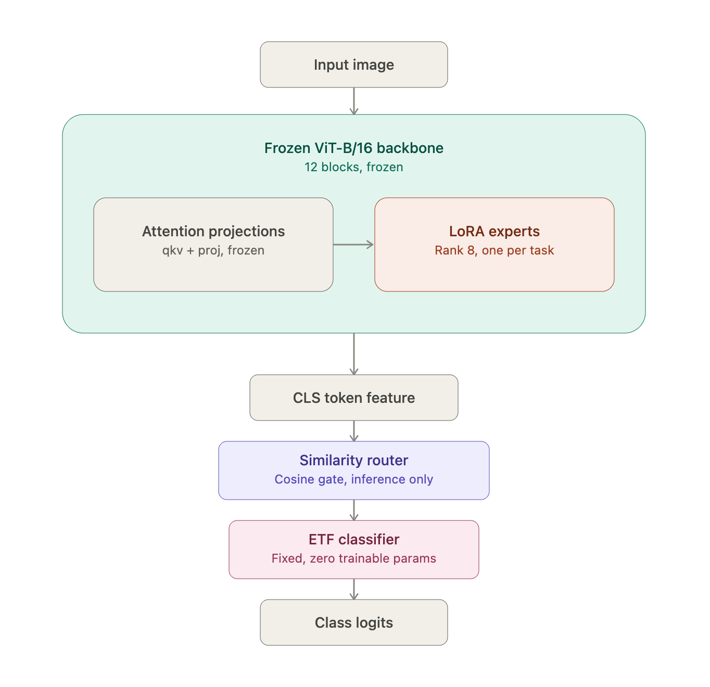

# Continual ViT: Task-Routed LoRA Experts leveraging a Fixed ETF Classifier to mitigate Feature and Classifier Drift

**Tackling catastrophic forgetting on Caltech-101 with a frozen ViT-B/16 backbone, per-task LoRA "experts" that are soft-routed at inference time via CLS-token similarity, an Equiangular Tight Frame (ETF) classifier borrowed from Neural Collapse theory, and an orthogonality-regularized loss that keeps new task subspaces from colliding with old ones.**

This repository documents an ongoing set of experiments in class-incremental continual learning. The core question: *can we add new classes to a vision transformer without quietly destroying its ability to recognize the old ones in an examplar free setting and without a learned gating network?*

---

## Why this problem is hard

Fine-tuning a pretrained ViT on new classes overwrites the shared representation, that the old classes depended on, which is referred to as catastrophic forgetting. The usual fixes leverage examplar replay methods (experience replay, distillation, regularizing the whole network) which either need access to old data or trade a lot of plasticity for stability. This project explores a parameter-isolation approach instead: Leveraging an expert for each task and freezing everything that matters, given each task its own small, disposable set of weights, and only worry about *how those weights are combined* at inference.

## Architecture



### 1. Frozen ViT-B/16 backbone
An ImageNet-pretrained `vit_base_patch16_224` (via `timm`) is loaded once and every original parameter is frozen for the rest of training. It never sees a gradient again and it's pure shared feature extraction.

### 2. Per-task LoRA experts
Every attention block's `qkv` and `proj` projections are wrapped so each task gets its own low-rank adapter (`rank=8`, `alpha=16`, `dropout=0.1`):
- **During training**, only the current task's adapter is active, namely a standard, cheap task-incremental LoRA fine-tune.
- **At inference**, every adapter that has ever been learned (including frozen ones from past tasks) is evaluated in parallel, and a softmax over **cosine similarity between each adapter's CLS-token delta and the frozen backbone's own CLS output** decides how much weight each expert gets. This is the "Mixture-of-Experts" part, where the router is a zero-parameter similarity heuristic computed on the fly.

That asymmetry is the interesting design bet: cheap, single-adapter training, but a soft, task-ID-free mixture at inference. The model doesn't need to be told which task an image belongs to before deciding how to classify it.

### 3. A fixed ETF classifier (the "ETF" in the filename)
Instead of a learned linear head, the classifier is a **Simplex Equiangular Tight Frame**: a set of maximally and equally separated unit vectors (one per class), constructed once via QR decomposition of a random Gaussian matrix and centered so every pair of class vectors has identical pairwise angle. It is registered as a `buffer`, not a `Parameter` — **it has zero trainable weights** and never changes across tasks.

This is a direct application of Neural Collapse theory: rather than letting a linear classifier drift and re-bias itself toward whichever classes were seen most recently (the classic source of the "recency bias" in class-incremental learning), the geometry of the decision boundary is fixed *before* any class is ever seen. Every task's features are simply pushed to align with their pre-assigned slot in the ETF.

### 4. Orthogonality-regularized loss
```
L = L_CE(class-balanced) + λ_orth · L_orth
```
`L_orth` is the mean squared cosine similarity between the current task's flattened, L2-normalized LoRA `A`/`B` matrices and every previous task's LoRA matrices, averaged across all 24 injected layers (`qkv` + `proj` × 12 blocks). It explicitly discourages a new task's expert from writing into the same low-rank subspace a previous task already claimed — the same intuition behind the inference-time router: the more orthogonal the experts, the more the cosine-similarity gate can cleanly tell them apart.

## Continual learning protocol

Caltech-101 (102 classes, 80/20 split per class) is partitioned by class index into two disjoint tasks:


Stage 1 trains only on the first 50 classes. Stage 2 then loads that frozen checkpoint, freezes the Task-1 LoRA adapter permanently, adds a brand-new adapter for the remaining 52 classes, and trains only on those.

### Two independent Task-2 ablations

Critically, **the two Task-2 runs are not chained to each other** — they are two separate branches that both start from the *same* Stage-1 checkpoint, differing only in the strength of the orthogonality penalty.


This isolates a single variable — orthogonality strength — while holding the learning rate (`1e-3`), weight decay (`1e-4`), and starting weights identical across both runs.

## Observations from the logs

**Stage 1 (Task-1 only, 50 classes)** converged cleanly: validation accuracy rose from ~5% at epoch 1 to the low 90s by epoch ~30, then plateaued around **93-94%** through epoch 60, at which point the run was stopped manually rather than burning the full 100-epoch budget on a curve that had already flattened — a reasonable place to cut an exploratory run short.

**Ablation A (`λ_orth = 100`)** showed the orthogonality term doing real work early: the regularization loss was highest in epoch 1 (~2.0) and decayed toward ~0 within a handful of epochs as the new adapter naturally settled into an under-used subspace, while Task-2 accuracy climbed steadily (roughly 0% - ~78% by epoch 50) alongside encouraging signs of retention on Task-1 classes — most Task-1 per-class accuracies stayed in the 0.8-1.0 range deep into Task-2 training.

That said, the retention wasn't uniform: at least one Task-1 class (index 46) dropped from ~90% pre-Task-2 to ~27% mid-Task-2-training, while a separate class (index 43) stayed persistently low (~33%) throughout — including *before* Task-2 training ever started. Distinguishing these two patterns is itself a useful diagnostic: one is a genuine forgetting event, the other is a class the model never really solved in Stage 1, which continual-learning metrics can otherwise conflate if you only look at the aggregate accuracy.

**Ablation B (`λ_orth = 1000`)** — a 10x stronger penalty — was configured and launched as the direct counterfactual to Ablation A. Both runs were stopped early (mid-training, via manual interrupt) to get fast comparative signal before committing full compute to either configuration; the head-to-head final numbers are the natural next thing to tabulate once both are re-run to convergence.

## Takeaways

**Strengths**
- **Zero-parameter inference-time router.** Task discrimination at inference comes from cosine similarity on features that already exist. This essentially means that there are no expensive gating network to train, nor there is any risk of gate collapse. It is a fully interpretable architecture.
- **A classifier that can't drift.** Because the ETF head has no trainable parameters, there's structurally no way for it to develop any recency class bias that normally plagues linear-head continual learning. 
- **Cheap task addition.** Adding a task means adding one small LoRA adapter (rank 8) and leaving 100% of the backbone and all prior adapters untouched — memory cost per task is tiny and prior tasks are mathematically incapable of being overwritten.


**Current limitations, and possible solutions**
- **Retention is strong but not perfect on a per-class basis.** The class-46 drop shows the orthogonality penalty (measured in aggregate, across all 24 layers) doesn't guarantee *uniform* protection for every old class — a natural next step is a per-class or per-layer forgetting audit rather than only the aggregate Task-1 accuracy curve.
- **The router is heuristic, not learned.** Cosine similarity on CLS deltas is cheap and interpretable, but a lightweight learned gate is the obvious next experiment to see whether it can out-discriminate the current zero-parameter version — especially as the number of tasks grows past two.
- **Fixed Classifier Geometry doesn't always match real world data.** The separation of the classifier space between two highly similar classes (Ex: Wolf and Dog) ought to be a lot different than between two dissimilar classes (Ex: Dog and Car). However, according to this fixed ETF geometry, the separation has been manipulated to remain same. 

